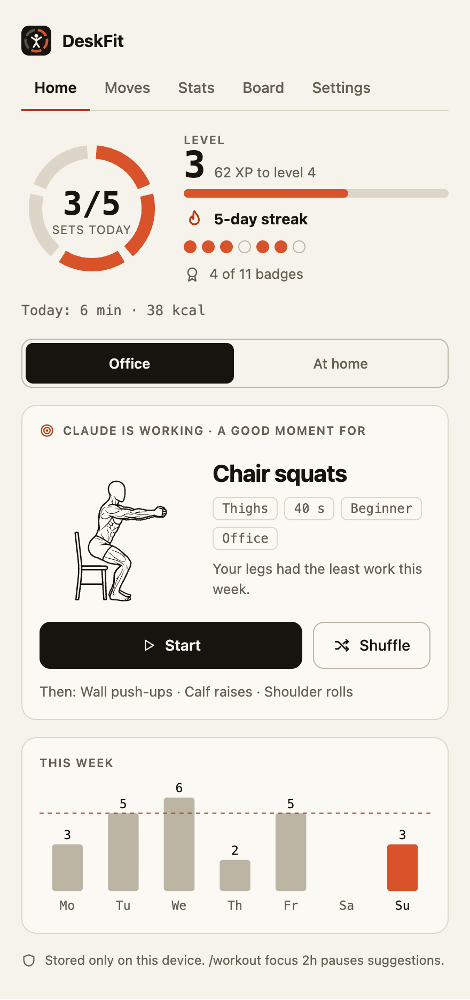
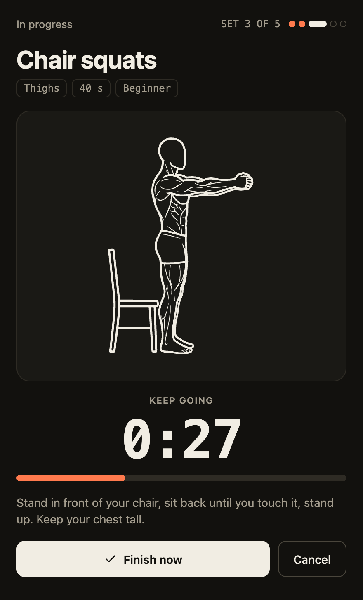
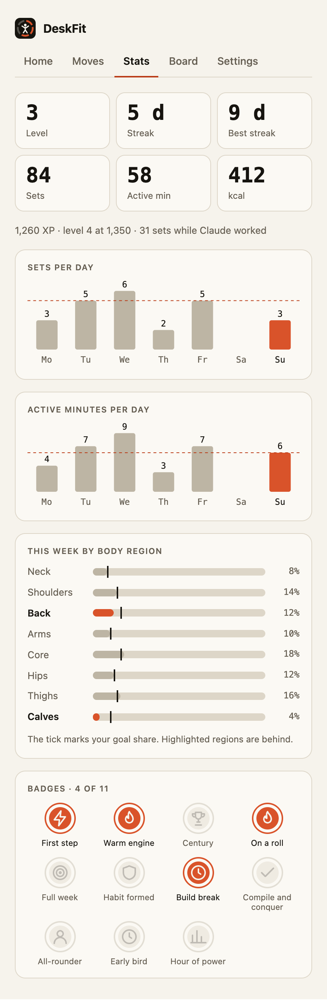

  

<h1 align="center">DeskFit</h1>

  <b>Move while Claude thinks.</b> 
  A Claude Code mod that turns the seconds you wait on Claude into short, well-chosen exercise sets, 
  with a daily goal, streaks, badges and optional leaderboards.

  <a href="https://deskfit.atanur.dev">Website</a> ·
  <a href="#install">Install</a> ·
  <a href="#using-it">Using it</a> ·
  <a href="#privacy">Privacy</a> ·
  <a href="server/README.md">Run your own leaderboard</a>

  
  &nbsp;
  
  &nbsp;
  

## What it does

When Claude has been busy for a while, a quiet line above your prompt suggests one move that fits your body, your desk and your
week so far. You do a set of 15 to 60 seconds, rate it, and the next ones adjust.

- **64 moves**, each with line-art illustrations, tagged with the muscles it works, where you can do it (33 work at an office desk,
  all work at home) and the gear it needs. Quiet mode removes jumping and loud moves.
- **A planner, not a shuffle.** It balances eight body regions over the last seven days against your goal, rests what you just
  worked, balances pushing and pulling, starts gently, and respects limits such as knees or lower back.
- **A game that stays out of the way.** Daily goal (3, 5, 8 or 12 sets), XP and levels, streaks, 11 badges, calories from MET values.
- **Optional leaderboards and private teams.** Join with a nickname only. See [Privacy](#privacy).
- **English and Türkçe**, light and dark, in the terminal and in the desktop app.

## Install

In Claude Code:

    /plugin marketplace add atanur/deskfit
    /plugin install deskfit@deskfit
    /workout

`/workout` opens DeskFit. A one-minute setup asks for your age, goal and where you work out. To remove it later:
`/plugin uninstall deskfit@deskfit`.

## Using it

| Command | What it does |
|---|---|
| `/workout` | Open DeskFit (or start the setup the first time) |
| `/workout moves` | Browse all moves, filter by region and place, try one |
| `/workout stats` | Level, streak, sets per day, work by body region, badges |
| `/workout board` | The leaderboard, your team and your account |
| `/workout settings` | Goal, gear, language, look, sound, your data |
| `/workout focus 2h` | Pause suggestions for a while (`focus off` ends it) |
| `/workout reset` | Erase your profile and progress from this machine |

Inside the pane every button has a key: `s` start, `n` shuffle, `f` finish, `c` cancel, `h` `m` `t` `l` `o` for Home, Moves,
Stats, Board and Settings, `Esc` closes it. The line above the prompt can be hidden in Settings.

## Privacy

DeskFit works fully offline and stores everything on your machine. Age, weight, height, goal and limits never leave the device.

The only thing it does online is download the public leaderboard when it opens (a plain request that carries nothing about you).
To turn even that off, clear the server address under Settings -> Leaderboard. Nothing about you is sent until you choose to
join, and then only your nickname, points, sets and finish times. You can delete the leaderboard account, or everything on your
device, from Settings.

By default DeskFit uses a public server at `https://deskfit-api.atanur.dev`. A company can host its own: see
[server/README.md](server/README.md) (Cloudflare Workers + D1, or a single SQLite file with Node or Docker).

DeskFit gives general, low-impact exercise suggestions and is not medical advice. Stop if something hurts.

## How the next move is chosen

Every move lists the muscles it works (`hooks/muscles.ts`: main muscles count 1, helpers 0.5), its kind (strength, cardio,
mobility, stretch), its movement pattern (push, pull, squat, hinge, core, rotate, move, release) and an effort from 1 to 5, taken from
its MET value. Muscles roll up into eight body regions.

The planner (`hooks/planner.ts`) compares the last seven days with the goal's target share per region and favours the regions that are
behind. Hard work in a region needs rest (strength and cardio count against it for about two days; stretches do not). It keeps the mix
of kinds close to the goal's, balances pushing and pulling, starts the day gently, follows a hard set with an easy one, and never
repeats a move from the last eight sets, the same region, or the same movement pattern back to back. Regions picked under Settings ->
Focus regions get extra weight. The home screen says why a move was chosen and shows the next few.

## Illustrations

Three looks, picked under Settings -> Look and sound -> Illustrations:

- **Line art** (default): detailed line drawings from [Workout Guide](https://github.com/bryllim/workout-guide) by Bryl Lim, built on
  [Everkinetic](https://github.com/everkinetic/data) artwork, licensed **CC BY-SA 4.0** (see [NOTICE.md](NOTICE.md)). Some moves were
  drawn with an image model in the same style (`art-extra/`) and share that licence. Every move has one.
- **Abstract**: bold silhouettes made in code that highlight the muscles a move works.
- **Stick figure**: the first, thin look.

## Development

    claude --plugin-dir .          # load the plugin from this folder
    npm install --legacy-peer-deps

| Check | What it does |
|---|---|
| `npm run ui` | Renders the pane in plain Node against a stand-in engine, presses through every screen and filter, fails on an exception, a duplicate key or a tree over 160 KB |
| `npm run plan` | Plays 14 simulated days for seven kinds of person; fails if the plan repeats itself, drifts from the goal's shares or leans on a few moves |
| `npm run muscles` | Checks the muscle table against the Workout Guide manifest and that no office move needs home-only gear |
| `npm run i18n` | Lists texts missing a Turkish translation or with mismatched `{placeholders}` |
| `npm run e2e` | Runs the API checks against a running server (see [server/README.md](server/README.md)) |
| `npm run preview`, `npm run mockups` | Preview the drawings and the pane designs |

To add a move: an entry in `hooks/catalog.ts`, its pose pair in `hooks/art.ts`, a MET value in `hooks/calories.ts` and its Turkish text
in `hooks/tr.ts`. To add a language, add a table like `tr.ts`, extend `Lang` in `hooks/i18n.ts` and the list in `hooks/settings.ts`; the
English text of each message is its key. The drawings are packed into `hooks/art-wg*.ts` by `npx tsx scripts/art/wg-build.mjs`; to add a
move that Workout Guide covers, put its slug in `scripts/art/wg-map.mjs`, then run `scripts/art/wg-fetch.mjs` and `wg-build.mjs`.

Calories per set = (MET - 1) x resting kcal per hour x hours. MET values are from the 2024 Adult Compendium of Physical Activities
(`hooks/calories.ts` lists the source of each); the resting rate comes from the Mifflin-St Jeor equation using age, weight, height and
(optional) sex. Estimates can be off by 20-30%.

## Website

`site/public/` holds the static site (no build step), served by a Cloudflare Worker with static assets. Deploy with
`cd site && npx wrangler deploy`; change the route in `site/wrangler.toml` to your own domain first.

## Credits and license

MIT, see [LICENSE](LICENSE). The exercise line art is CC BY-SA 4.0, see [NOTICE.md](NOTICE.md). DeskFit is an independent project,
not made, endorsed or supported by Anthropic. Claude and Claude Code are trademarks of Anthropic.
